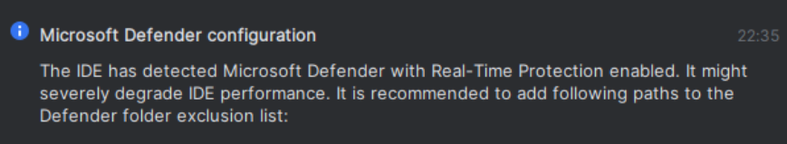

# Uruchamianie PHP 8 + XDEBUG na Windows w WSL na Docker
#### Wersja z php8.2-fpm (wersja z kontenerem php8.2 oddzielnym kontenerem Nginx - LINK)

Pliki projektu znajdują się na windows C:\Users\NazwaUzytkownika\katalog. Kontener uruchamiam z poziomu Ubuntu 24.04 
uruchomionym przez WSL 2 przechodządz na ``/mnt/c/Users/NazwaUzytkownika/katalog``, standardowo 
przez ``docker compose up``. Nie jest to zbyt wydajne rozwiązanie lecz w przypadku mocnych maszyn nie ma to
widocznego negatywnego wpływu na wydajność pracy. Na słabszych maszynach będzie to działać zbyt wolno, wtedy
może być konieczne trzymanie plików w katalogu ubuntu np /home/NazwaUzytkowinka( mozna też próbować zwiekszyć ilość rdzeni i pamięci dla WSL).

Celem projektu jest uruchomienie projektu PHP na Windows za pomocą WSL, Dockera z działającym XDEBUG oraz możliwość debugowania aplikacji za pomocą breakpointów w PhpStorm na Windows.

1. W PhpStorm powinien wyskoczyć komunikat na temat wykluczenia folderu projektu z Windows Defender, ale u mnie pojawił się dopiero po którymś z kolejnych restartach (lub po wykonaniu kroku nr 2). Jeśli się nie pojawi lub podczas dodawania folderu coś pójdzie nie tak, spróbuj przejść do kroku 2. Wyłączenie Microsoft Defender nie zadziałało u mnie, dopiero ta komenda.

   
   

2. Jako administrator z PowerShell:
   > PS C:\Users\k> Enable-WindowsOptionalFeature -Online -FeatureName Microsoft-Windows-Subsystem-Linux

   Po tych krokach breakpointy powinny już działać. Uruchomiony serwer z Xdebug nie wpływa u mnie widocznie na wydajność.

   

3. Ustawienia PhpStorm dla podglądu.

### Jak debugować?

Sprawdź logi Xdebug. Jeśli jest informacja, że udało się połączyć z `host.docker.internal`, a mimo to nadal nie działa, problem najprawdopodobniej leży w konfiguracji po stronie Windowsa.

> cat /tmp/xdebug.log  
> Sprawdzać logi kontenera

